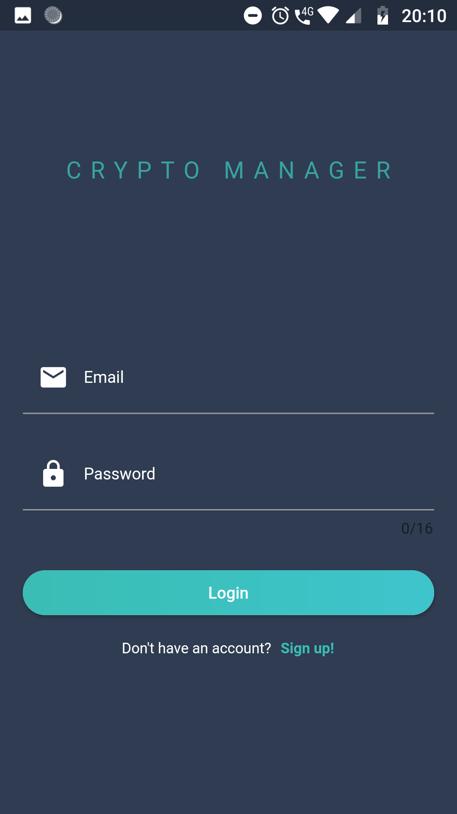
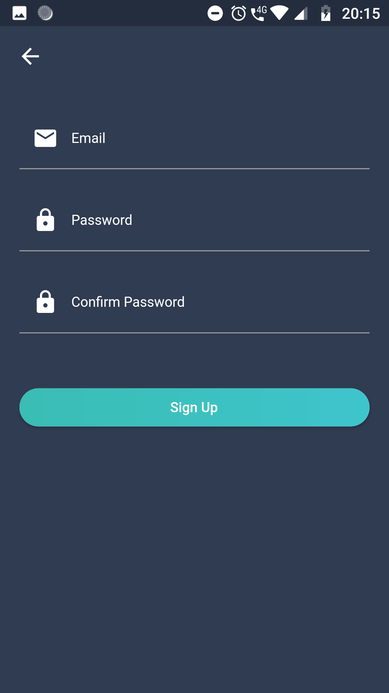
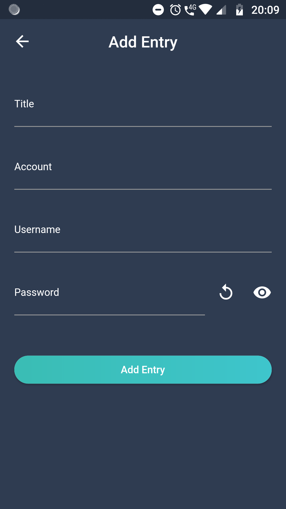

[Features](#features) | [Screenshots](#screenshots) | [Members](#members)

 &nbsp;  &nbsp; 

Password manager application written in Dart/Flutter

## Features
<!--TODO -->

## Screenshots

&nbsp;

&nbsp;

<!-- More screenshots -->

## Members
<!-- TODO -->

RA: 002201801390 - Eduwardo Horibe Keizo

RA: 002201800485 - Matheus Gaboardi Tralli

RA: 002201800533 - Rafael Soares Torres

RA: 002201802138 - Renan Rodrigues Bertolotti

